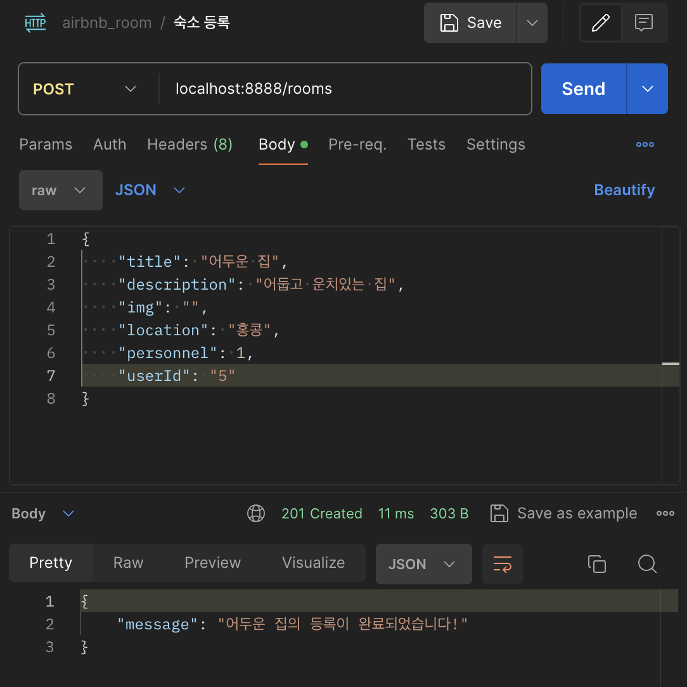

# 6주차_Day1
Node.js api 수정 및 유효성 검사

## 배운 내용
- 유효성 검사
    - express-validator 설치
    - rooms.js 유효성 검사 처리 및 에러 핸들링
    - 유효성 검사 모듈화
- 오류 수정
    - 콜백 함수로 들어오는 값 고려하여 rooms.js의 api 수정

## 이후 진행할 내용
- 유효성 검사 모듈 핸들러 추가 후 콜백까지 정상적으로 실행되도록 수정


## 모듈화로 핸들링
```js
router.route('/')
.get(
    [
        body('id').notEmpty().isInt().withMessage('유효성 검사'),
        handler
    ], 
callBack())
```
- 콜백 함수를 호출하기 전에 처리하는 핸들러(요청이 왔을때 호출되는 메서드) 모듈을 콜백 함수 전에 불러와 사용할 수 있음
- 모듈의 실행이 끝난 다음 콜백 실행


## 유효성 검사 중 정수와 문자열 처리

- useId 컬럼의 경우 타입이 INT로 설정되어 있는데, 숫자가 문자열로 입력될 경우도 숫자와 동일하게 처리된다. = 오류가 발생하지 않고 자동적으로 정수로 인식된다.


## 에러
### 에러 상황
```
TypeError: Assignment to constant variable.
```
- 숙소 정보 수정 put 요청에서 해당 에러 발생

### 에러 해결
```js
// const { id } = req.params -- x
let { id } = req.params
id = parseInt(id)
```
- const로 변수 선언을 한 뒤, 타입을 변환해주려 시도해 TypeError가 발생하였다.
- const를 let으로 변경하여 오류를 해결하였다.