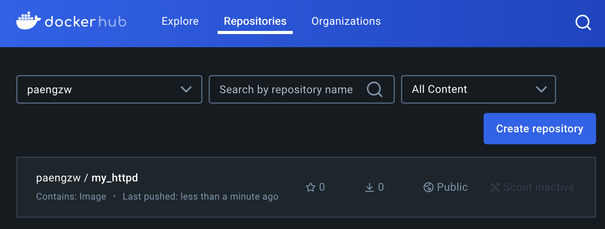
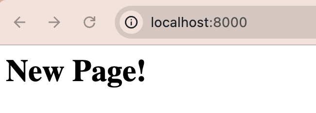

# 도커 이미지 만들기 실습
## 실습 목표
1. 도커 컨테이너의 상태를 조정해서 우리가 원하는 것을 만들 수 있는지 시도
2. 변경한 상태를 반영하는 이미지 생성
3. 해당 과정을 **자동화**하는 방법 공부

## 실습 계획
1. 이전에 가져왔던 이미지와 컨테이너들을 모두 삭제
2. **httpd** 이미지를 가져와 실행
  - 기본 페이지 설정 변경
  - 컨테이너 안의 특정 파일 수정 작업 시행
3. 실행되는 이미지 작성
  - 해당 이미지로 컨테이너를 실행하면 항상 우리가 원하는 문서가 기본 페이지로 제공되도록 작성
4. 이미지 생성 자동화
5. 이미지 레지스트리에 올리기

<br>

# 1. 이미지 및 컨테이너 삭제
## 이미지 확인 및 삭제
- 현재 로컬에 존재하는 이미지들 확인
```
docker images
```
- 이미지 삭제
```
docker rmi <이름/ID>
```

## 컨테이너 확인 및 삭제
- 실행중인 컨테이너 확인
```
docker ps
```
- 실행 상태와 상관없이 전체 컨테이너 확인
```
docker ps -a
```
- 컨테이너 삭제
```
docker rm <이름/ID>
```

<br>

# 2. 'httpd' 이미지를 가져와 실행
- httpd 이미지로 새로운 컨테이너 실행
  - -p 옵션은 반드시 이미지명 앞에 작성
```
docker run httpd

docker -p 8000:80 httpd
```
- httpd 이미지를 local에서 찾을 수 없는 경우 원격에서 image 레이어들을 pull
```
Unable to find image 'httpd:latest' locally
latest: Pulling from library/httpd
262a5f25eec7: Pull complete 
bac7bacf0601: Pull complete 
4f4fb700ef54: Pull complete 
6a762f9da5ef: Pull complete 
e6566df07573: Pull complete 
2697b59c8baf: Pull complete 
Digest: sha256:932ac36fabe1d2103ed3edbe66224ed2afe0041b317bcdb6f5d9be63594f0030
Status: Downloaded newer image for httpd:latest
```
- 가져온 이미지 레이어들을 컨테이너에서 실행
- 172.17.0.2 IP 주소에서 아파치(httpd) 웹서버가 수신 준비
```
Digest: sha256:932ac36fabe1d2103ed3edbe66224ed2afe0041b317bcdb6f5d9be63594f0030
Status: Downloaded newer image for httpd:latest
AH00558: httpd: Could not reliably determine the server's fully qualified domain name, using 172.17.0.2. Set the 'ServerName' directive globally to suppress this message
AH00558: httpd: Could not reliably determine the server's fully qualified domain name, using 172.17.0.2. Set the 'ServerName' directive globally to suppress this message
```

- 옵션을 사용해 container 안의 shell을 얻어옴
```
docker run -it httpd /bin/bash

docker run -p 8000:80 httpd
```

- `index.html`의 위치 확인 명령어
```
grep DocumentRoot /usr/local/apache2/conf/httpd.conf

```
  - `/usr/local/apache2/htdocs`에 존재함을 알 수 있음
  ```
  # DocumentRoot: The directory out of which you will serve your
  DocumentRoot "/usr/local/apache2/htdocs"
      # access content that does not live under the DocumentRoot.
  ```
  - 현재 파일 내의 내용 확인
  ```
  root@f0c6cdc86759:/usr/local/apache2/htdocs# cat index.html
  <html><body><h1>It works!</h1></body></html>
  ```
  - 새로운 내용 입력 -> control + d 로 종료
  ```
  root@f0c6cdc86759:/usr/local/apache2/htdocs# cat > index.html
  <html><body><h1>New Page!<h1><body><html>
  ```
```
httpd-foreground
```
- localhost:8000 로 접속해 메세지 확인

<br>

# 3. 실행되는 이미지 작성
- 컨테이너 재실행
```
docker start e02e2564bd05<컨테이너 ID>
```

- container 안의 shell로 재진입
```
docker exec -it e02e2564bd0<컨테이너ID> /bin/bash
```

- 로컬 컴퓨터에 이미지 생성
```
docker commit e02e2564bd05<컨테이너ID> my_httpd:0.1
```
```
REPOSITORY   TAG       IMAGE ID       CREATED         SIZE
my_httpd     0.1       680b047862d8   9 seconds ago   178MB
```

- my_httpd:0.1 이미지로 실행
  - httpd-foreground: 웹서버를 실행한다는 의미
```
docker run -p 8000:80 my_httpd:0.1 httpd-foreground
```

<br>

# 4. 이미지 생성 자동화
## Dockerfile
- 계층 구조를 이용하여 도커 이미지를 만드는 절차를 기술하는 파일
### Dockerfile 구조
- FROM : 이미지 생성시 기반이 되는 베이스 이미지
- RUN : 도커 이미지가 생성되기 전 수행되는 쉘 명령어
- ENTRYPOINT : 도커 컨테이너가 시작되었을 때 실행할 실행파일 또는 쉘 스크립트

<br>

- Dockerfile 작성

- Dockerfile 열기
```
cat Dockerfile
```
- docker build
```
docker build -t my_httpd:0.2 .
```
- 이미지 build 후 컨테이너 실행
```
docker run -p 8000:80 httpd:0.2
```

<br>

# 5. 이미지 레지스트리에 올리기
- docker login
```
docker login
```
---

## ✅ google account로 계정 생성한 경우 로그인
google account로 소셜 로그인을 한 경우, password를 입력하려면 일정한 방식을 따라야 했다. 해당 계정의 accessToken을 발급받고 이를 password로 사용하는 과정을 거쳤다. accessToken 발급 과정은 docker 페이지의 내용을 따랐다.

### 수정한 명령어
```
docker login -u paengzw<사용자 이름>
```

- 참고 : [Login command in docker when using gmail account](https://stackoverflow.com/questions/78036058/login-command-in-docker-when-using-gmail-account)
- 참고 : [Create and manage access tokens](https://docs.docker.com/security/for-developers/access-tokens/)

---

- tag 생성
```
docker tag my_httpd:0.2 paengzw/my_httpd:0.3
```

- push
```
docker push paengzw/my_httpd:0.3
```


- 원격 레지스트리에서 이미지 가져와서 실행
```
 docker run paengzw/my_httpd:0.3
```

<br>

# 남아있는 일들
- 환경변수의 이용
- 컨테이너들 사이 및 호스트와 컨테이너 사이에 TCP/IP를 이용한 통신
- 호스트와 컨테이너 사이의 볼륜 공유
- 도커 클린업

<br>

# ✅ Docker Mac Container IP Network 172.17.0.2 대역 접속 불가 문제
맥북을 통해 실습을 진행하던 중, 아파치 웹서버가 수신 준비된 172.17.0.2로 접근해 메세지를 확인할 수 없는 문제가 발생했습니다. <br>
검색을 통해 mac은 localhost와 같은 방식으로 container에 접속해야 한다는 사실을 알게되어, `docker run`시 포트를 설정해 해결하였습니다.

## 기존 명렁 
```
docker run httpd
```

## 수정 명령
```
docker run -p 8000:80 httpd
```
localhost의 방식으로 실행한 이후, 메세지를 정상적으로 확인할 수 있었습니다.


- 참고 : [Docker Mac Container IP Network 접속 불가 (172.xx.xx.xx) 대역](https://clack2933.tistory.com/43)
- 참고2 : [docker docs - Explore networking features on Docker Desktop](https://docs.docker.com/desktop/networking/#there-is-no-docker0-bridge-on-macos)