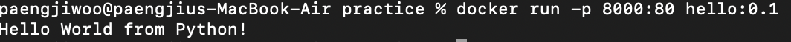

# 실습 과제

# 로컬 이미지 이용하여 컨테이너 만들고 실행
## 1. Dockerfile 생성
```
FROM ubuntu:22.04

RUN apt-get update && apt-get install -y python3
COPY hello.py .

ENTRYPOINT ["python3", "hello.py"]
```
- hello.py
```py
print("Hello World from Python!")
```
## 2. Dockerfile로 hello:0.1 이미지 생성
```
docker build -t hello:0.1 .
```
## 3. 로컬에서 생성한 hello:0.1 이미지 실행
```
docker run -p 8000:80 hello:0.1
```

## 결과물
