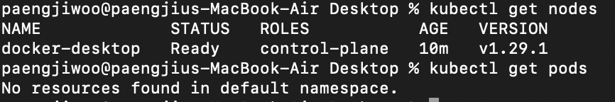
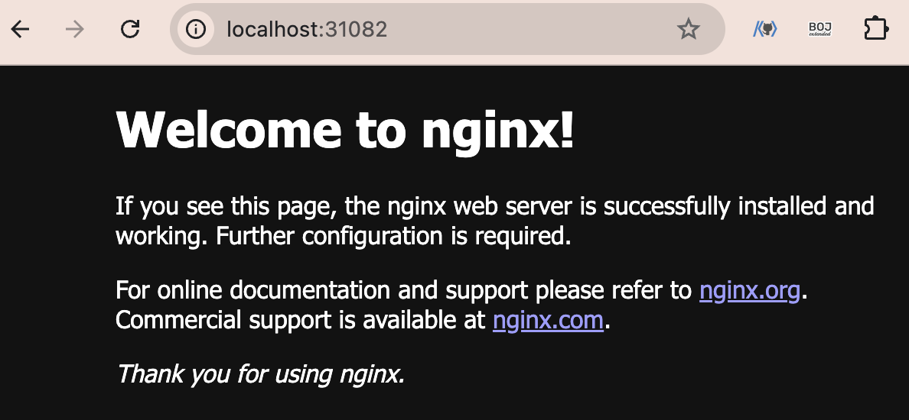

# 쿠버네티스 사용법

### k8s 내용 정리
[📁 내용 정리 Notion](https://www.notion.so/paengzw/17-Day2-4858aa92e30447889acf4f1b26755e2e)

<br>

# 실습 내용
- docker Desktop을 활용한 실습
1. 포드의 생성과 컨테이너의 실행
2. deployment를 이용하여 동일한 기능을 하는 포드의 replicaset을 실행
3. 클러스터 외부로부터의 접근이 가능하도록 service를 실행
4. 생성된 k8s 오브젝트들을 삭제
5. k8s 클러스터의 현재 상태 조회
6. object spec을 작성하는 기초 익히기

<br>

## Node와 Pod 정보 조회
```
kubectl get nodes

kubectl get pods

kubectl get pods --all-namespaces 

kubectl get pods -o wide --더 많은 정보 확인 가능
```


<br>

## 컨테이너 이미지를 이용한 포드의 생성
```
kubectl run nginx-pod --image=nginx
```

<br>

## deployment를 이용하여 동일한 기능을 하는 포드의 replicaset을 실행
- replicaset : 동일한 모습의 포드들의 복제본 모음
- deployment
  - 레플리카셋으로 구성
  - 단순한 레플리카셋에 비해 동적 업데이트 및 롤백, 배포 버전의 관리 등이 유연하여 응용 배포에 널리 이용
  - stateless 응용 배포에 이용 → 포드는 언제라도 사멸할 수 있기 때문

### 동작 방식
deployment 상태를 선언하면 k8s가 동적으로 의도된 상태가 되도록 replicaset을 관리
- dpy-nginx라는 이름의 nginx의 이미지의 deployment 생성
```
kubectl create deployment dpy-nginx --image=nginx
```
- deployment 조회
```
kubectl get deployment -o wide
```
- deployment 상세 조회 (동일한 방식으로 pod도 조회 가능)
```
kubectl deployment dpy-nginx
```
- pod 동적 확장 명령 (e.g. dpy-nginx pod 3개로 확장)
```
kubectl scale deployment dpy-nginx --replicas=3
```

<br>

## 클러스터 외부로부터의 접근이 가능하도록 service를 실행
- k8s service
  - 클러스터 내부의 포드에 의하여 실행되는 응용을 외부에서 접근 가능하도록 노출하는 기능을 하는 오브젝트
  - 노출하는 대상 : 특정 포드(들의 집합) or 컨테이너 특정 포트
### NodePort의 형태로 실습
```
kubectl expose pod nginx-pod --type=NodePort --name=pod-svc --port=80
```

```
kubectl get svc
```

```
curl localhost:31082
```


<br>

## 생성된 k8s 오브젝트들을 삭제
- 생성한 service 오브젝트를 삭제
```
kubectl delete service pod-svc
```
- kubectl run에 의하여 생성된 포드 삭제
```
kubectl delete pod nginx-pod
```
  - deployment에 pod가 존재하는 이상 해당 pod를 삭제할 수는 없음 (k8s의 선언적 성질)
- 생성한 deployment 오브젝트를 삭제
```
kubectl delete deployment dpy-nginx
```

<br>

# 매니페스트
k8s 오브젝트에 대한 명세를 파일로 기록한 것
- YAML 형태를 이용
- 파일에 각 오브젝트에서 의도하는 상태를 기술
- deployment.yaml : 앞서서 `kubectl create deployment` 명령을 이용한 것과 동일한 형태의 디플로이먼트 생성 가능한 파일
- service.yaml : 앞서 `kubectl expose deployment` 명령을 이용한 것과 동일한 서비스를 생성하는데 이용할 수 있는 파일
  - port: 웹서버가 리스닝하고 있는 포트
  - nodePort: 외부에 공개된 port
